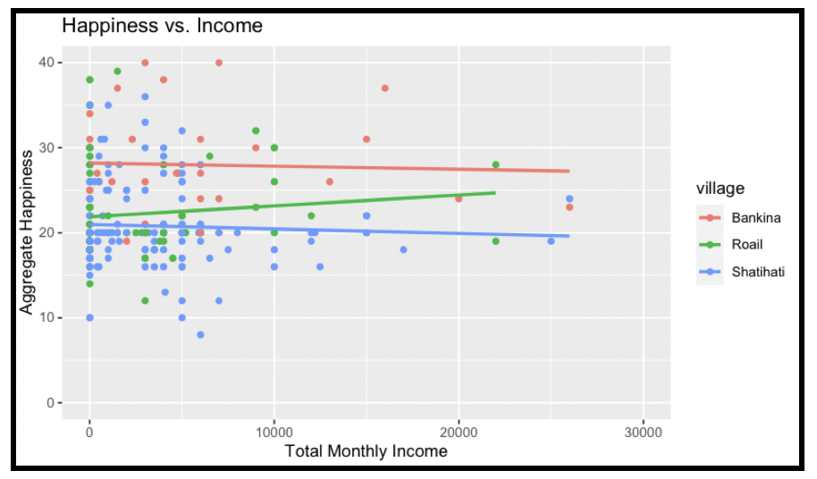
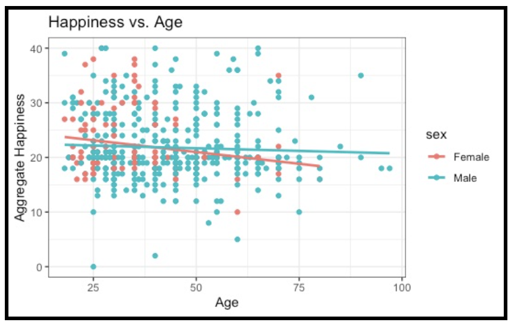
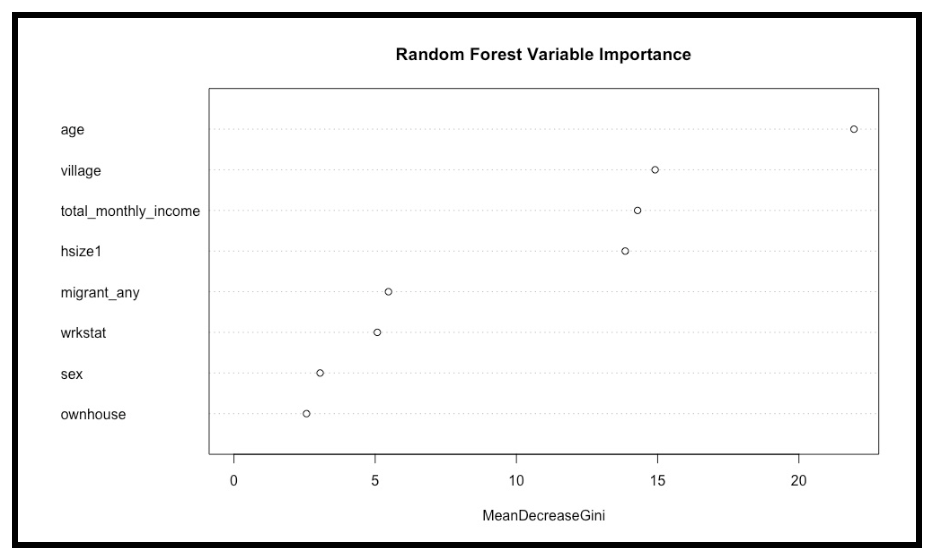
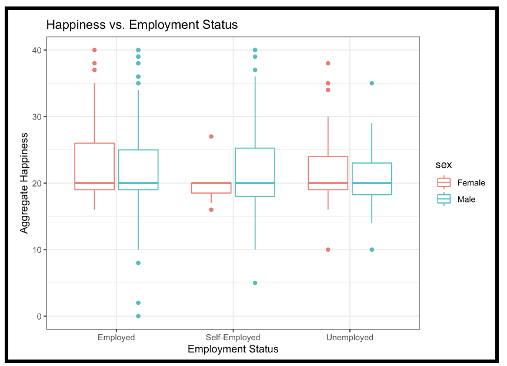

```{r echo=F, eval=F}
#to build this website into the _site directory, run
rmarkdown::site_generator()
```

<br></br>

##### <u>Hypothesis 1</u>
##### Total income has little effect on the happiness of residents in rural Bangladesh.


<br></br>

##### <u>Hypothesis 2</u>
##### Age has little effect on happiness in males, but has an effect on female happiness.


<br></br>

##### <u>Hypothesis 3</u>
##### Age is the most important variable in determining happiness.


<br></br>

##### <u>Hypothesis 4</u>
##### Employment Status has little effect on happiness regardless of sex.

