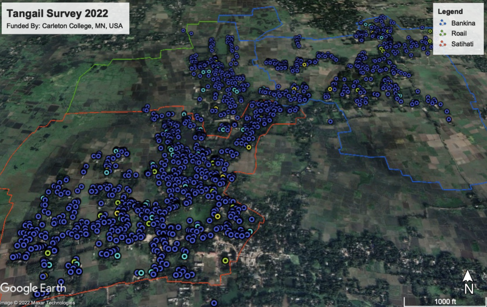

```{r echo=F, eval=F}
#to build this website into the _site directory, run
rmarkdown::site_generator()
```
 


<br>

# Determinants of Happiness in Rural Bangladesh 
  
</br>

##### Welcome to our group project. Please use the headers to navigate our study!
